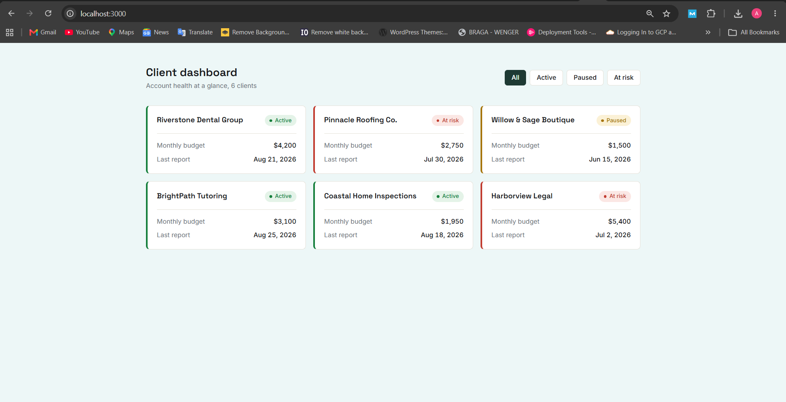
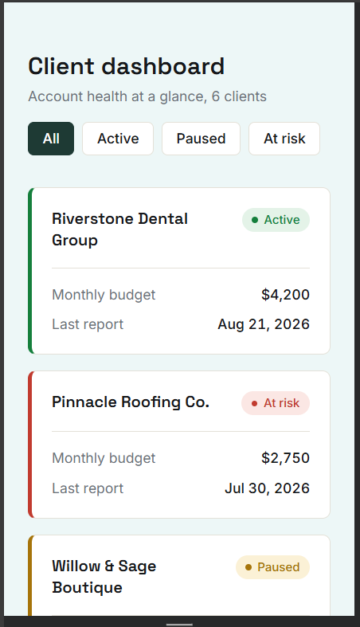

# TDN Client Dashboard

A client accounts dashboard built for the TDN technical assessment That is Done by Alvin Kiarie Mwaniki. 
The dashboard Reads client data from a local JSON file and renders it as a filterable card grid.

## Stack

- Next.js  (App Router)
- Tailwind CSS v4
- next/font for self hosted Google Fonts (Inter and Space Grotesk)

No backend, no API calls. Data is imported directly from `data/clients.json`.

## Getting started

```bash
If node module dont exist run 

npm install
npm run dev
```

Open `http://localhost:3000`.

## Project structure

```
app/
  components/
    ClientDashboard.js   // owns filter state, passes filtered data down
    ClientCard.js         // presentational, one card per client
    StatusBadge.js         // presentational, maps status to label and color
    FilterControls.js      // status filter buttons
  layout.js
  page.js
  globals.css              // Tailwind import and design tokens
data/
  clients.json
```

I split the dashboard into small, single purpose components rather than one large file. `ClientDashboard` is the only component that touches state, `ClientCard`, `StatusBadge`, and `FilterControls` are pure and easy to reuse or restyle on their own.

## Decisions and trade offs

**Status colors are functional, not decorative.** Active, paused, and at risk each get a distinct color used consistently in the badge and the card's left border, so status is readable at a glance even before reading the text.

**I used my own custom design** in `globals.css` under `@theme`, rather than styling components ad hoc. Colors, fonts, and spacing all trace back to that one place, which is how I would set up a real client project too.

**Filtering is done client side with `useMemo`** 

**With more time I would add:**
- Sorting (by budget or last report date)
- A loading and empty state for when data comes from a real API instead of a static file
- Unit tests for the filter logic and currency and date formatting helpers
- Keyboard focus states and ARIA labeling on the filter buttons for accessibility

## Responsiveness
## Screenshots

**Desktop (1440px+)**



**Mobile (375px)**



The grid is one column on phone widths, two columns on tablet, and three on desktop, using a plain CSS grid with breakpoints rather than a component library grid system.

